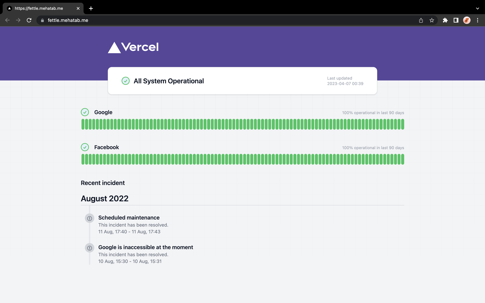

# hovanhoa | status

This repository powers the personal status page for `hovanhoa` at `https://status.hovanhoa.net/`, built on top of GitHub Actions, Issues, and Pages.  
Source: `https://github.com/dryfolio/status.hovanhoa.net`.




# Usage
First of all, you need to fork this repository.

## Update URL's
Update the urls and name in `urls.cfg` file present in `public > urls.cfg` file.

```text
Google=https://google.com
Facebook=https://facebook.com
```

## Incidents URL
Incidents are loaded from GitHub Issues with the `incident` label.

- Default repository: `dryfolio/status.hovanhoa.net`
- API endpoint:

```text
https://api.github.com/repos/dryfolio/status.hovanhoa.net/issues?per_page=20&state=all&labels=incident
```

## Service status URLs
Service status is loaded from log files stored in this repository under `public/status`.

- Default repository: `dryfolio/status.hovanhoa.net`
- Raw content endpoint:

```text
https://raw.githubusercontent.com/dryfolio/status.hovanhoa.net/main/public/status/${key}_report.log
```

## Deployment setup

Then, you need to enable GitHub Pages on your forked repository. You can do this by going to `Settings > Pages` and enabling it on the `main` branch.

In Build and deployment section select GitHub Actions.

## Change monitoring interval
If you want to change the time interval of monitoring then you can change it in `.github > workflows > health-check.yml` file.
update the cron time in the following line.

```yaml
    on:
      schedule:
        - cron: "0 0/12 * * *"
```

## Reporting your first incident
1. Go to issues tab 
2. Create a new label `incident`
3. Create a issue
4. Add the label `incident` to the issue


# How it works

- Hosting
    - GitHub Pages is used for hosting the status page.

- Monitoring
    - Github Workflow will be triggered every 1 Hr (Configurable) to visit the website.
    - Response status and response time is commited to github repository.

- Incidents
    - Github issue is used for incident management.

# Contributing
Feel free to submit pull requests and/or file issues for bugs and suggestions.
